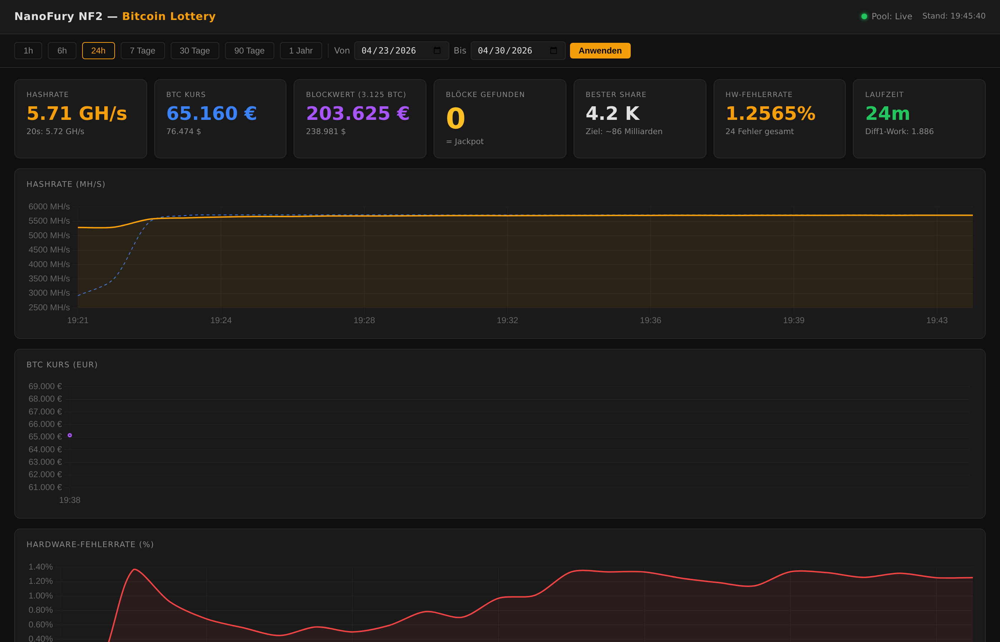

# Bitcoin Lottery — NanoFury NF2 Solo Miner

A Dockerized Bitcoin solo miner running on a NanoFury NF2 USB ASIC. The device contributes ~5 GH/s against a ~700 EH/s network — statistically unlikely, but non-zero. Done for the experience, not for profit.



## Quick Start

```bash
# One-time host setup (USB driver fix)
sudo cp udev/50-nanofury.rules /etc/udev/rules.d/
sudo udevadm control --reload-rules
sudo udevadm trigger --subsystem-match=usb --action=add

# Configure
cp .env.example .env && nano .env   # set MINER_WALLET

# Start
docker compose up -d
```

Dashboard: **`http://<server-ip>:8080`**

## Hardware

- **Device:** NanoFury NF2 by bitshopper.de (`04d8:00de`)
- **Pool:** [solo.ckpool.org](https://solo.ckpool.org) — 0% fee, full 3.125 BTC reward goes directly to `MINER_WALLET`

## CLI Quick Check

```bash
docker exec nanofury_lottery bfgminer-rpc devs    # hashrate + device status
docker exec nanofury_lottery bfgminer-rpc pools   # pool connection
watch -n 30 ./scripts/status.sh                   # terminal summary
```

## Documentation

| | |
|--|--|
| [docs/dashboard.md](docs/dashboard.md) | Dashboard features, metrics explained |
| [docs/hardware.md](docs/hardware.md) | NanoFury specs, USB driver fix |
| [docs/mining.md](docs/mining.md) | How solo mining works, wallet setup |
| [docs/winning.md](docs/winning.md) | **What to do if a block is found** |
| [docs/troubleshooting.md](docs/troubleshooting.md) | Common failures and fixes |
# bitcoin-lottery
