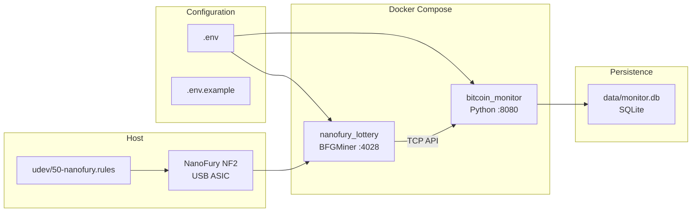
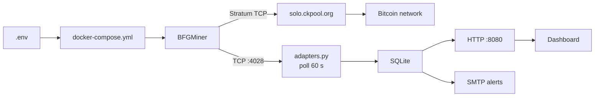

# bitcoin-lottery

[](https://www.python.org/)
[](./docker-compose.yml)
[](./LICENSE)
[](https://github.com/h3rb3rn/bitcoin-lottery)

Docker-based Bitcoin solo miner for legacy USB ASIC hardware. Repurpose retired miners with an integrated monitoring dashboard and zero-fee solo-mining logic.


---

## What This Is

A production-ready containerized stack that turns end-of-life Bitcoin mining hardware into a low-cost solo-mining lottery node. The goal is not profit — a NanoFury NF2 contributes ~2 GH/s against a ~700 EH/s network. The goal is **infrastructure reuse**: hardware that would otherwise sit in a drawer contributes work, generates metrics, and sends alerts.

**Pool:** [solo.ckpool.org](https://solo.ckpool.org) — 0% fee. A block found pays the full 3.125 BTC reward directly to `MINER_WALLET`. No pool cut.

---

## Features

| Feature | Detail |
|---------|--------|
| **Monitoring dashboard** | Web UI on `:8080` — live hashrate, pool status, BTC price, best share, block history |
| **Multi-miner support** | Up to 10 miners per stack via `MINER_N_*` env vars |
| **Multi-manufacturer adapters** | BFGMiner, CGMiner, Antminer HTTP, Whatsminer, Bitaxe REST |
| **SQLite time-series** | 30-day metrics retention, 365-day price history |
| **SMTP alerting** | Miner down/recovered, block found, weekly report |
| **udev automation** | USB driver conflict resolved on plug via udev rule |
| **Source build** | BFGMiner compiled from [luke-jr/bfgminer](https://github.com/luke-jr/bfgminer) with `--enable-nanofury` |

---

## Quick Start

```bash
# 1. One-time host setup — resolves usbhid driver conflict (see docs/hardware.md)
sudo cp udev/50-nanofury.rules /etc/udev/rules.d/
sudo udevadm control --reload-rules
sudo udevadm trigger --subsystem-match=usb --action=add

# 2. Configure credentials and hardware
cp .env.example .env
$EDITOR .env   # set MINER_WALLET, MINER_POOL_URL, optional SMTP_*

# 3. Build and start (first build ~5 min)
docker compose up -d

# 4. Dashboard
open http://<server-ip>:8080
```

---

## Architecture



**Data flow:**



---

## Configuration

All runtime configuration lives in `.env`. Copy `.env.example` and edit:

```bash
# Mandatory
MINER_POOL_URL=stratum+tcp://solo.ckpool.org:3333
MINER_WALLET=your_bitcoin_address_here

# Hardware (NanoFury oscillator — valid range 48–56)
OSC6_BITS=54

# Multi-miner: repeat for MINER_2_*, MINER_3_*, up to MINER_10_*
MINER_1_NAME=NanoFury NF2
MINER_1_TYPE=bfgminer          # bfgminer | cgminer | antminer | whatsminer | bitaxe
MINER_1_HOST=nanofury_lottery
MINER_1_PORT=4028

# SMTP alerts (leave SMTP_HOST empty to disable)
SMTP_HOST=smtp.example.com
SMTP_PORT=587
SMTP_USER=miner@example.com
SMTP_TO=you@example.com
```

---

## Monitoring Dashboard

The dashboard is served by a Python 3.11 stdlib HTTP server (no framework). It reads from SQLite and exposes a REST API:

| Endpoint | Description |
|----------|-------------|
| `GET /` | Dashboard UI |
| `GET /api/now` | Live aggregate + per-miner metrics + BTC price |
| `GET /api/history?range=24h` | Time-series (1h / 6h / 24h / 7d / 30d / 90d / 365d) |
| `GET /api/miners` | Registered miner list |
| `GET /api/stats` | Cumulative statistics |
| `GET /api/blocks` | Block events log |
| `GET /api/prices?range=7d` | BTC price history |

BTC price is fetched from CoinGecko once per day. Metrics are retained 30 days; price history 365 days.

---

## CLI Reference

```bash
# Container management
docker compose up -d
docker compose logs -f
docker compose down
docker compose build --no-cache && docker compose up -d

# BFGMiner RPC (requires container running)
docker exec nanofury_lottery bfgminer-rpc devs       # hashrate + device status
docker exec nanofury_lottery bfgminer-rpc pools      # pool connection
docker exec nanofury_lottery bfgminer-rpc summary    # full summary

# USB verification
lsusb | grep -i "04d8"
readlink /sys/bus/usb/devices/1-7:1.0/driver         # empty = driver unbound (correct)
docker exec -it nanofury_lottery lsusb

# Terminal monitoring
watch -n 30 ./scripts/status.sh
```

---

## Hardware

- **Device:** NanoFury NF2 (`04d8:00de`) — Bitfury ASIC via MCP2210 USB-to-SPI bridge
- **Hashrate:** ~2 GH/s at `osc6_bits=54`
- **Power:** ~0.5 W (100 mA @ 5 V USB)
- **Driver conflict:** Linux auto-binds `usbhid`; the udev rule unbinds it on plug

See [docs/hardware.md](docs/hardware.md) for full driver details and clock tuning.

For integrating additional legacy hardware (Antminer S9, GekkoScience, Bitaxe, etc.) in a Proxmox/LXC environment, see [LEGACY.md](LEGACY.md).

---

## Documentation

| | |
|--|--|
| [docs/dashboard.md](docs/dashboard.md) | Dashboard metrics and API reference |
| [docs/hardware.md](docs/hardware.md) | NanoFury specs, USB driver fix, clock tuning |
| [docs/mining.md](docs/mining.md) | Solo mining mechanics, wallet setup |
| [docs/winning.md](docs/winning.md) | **What to do if a block is found** |
| [docs/troubleshooting.md](docs/troubleshooting.md) | Common failures and fixes |
| [LEGACY.md](LEGACY.md) | Legacy hardware integration (Proxmox/LXC) |

---

## License

[Apache License 2.0](./LICENSE)
